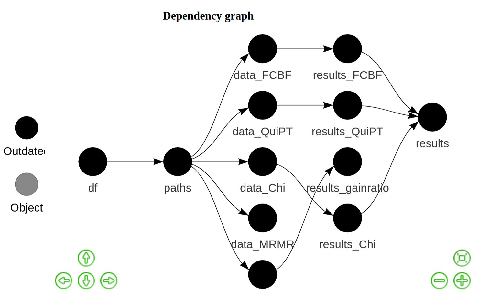
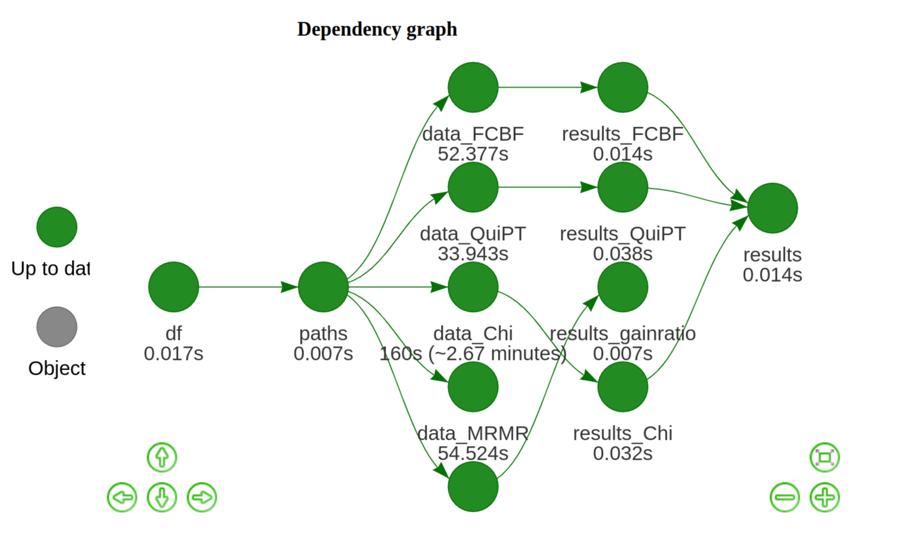
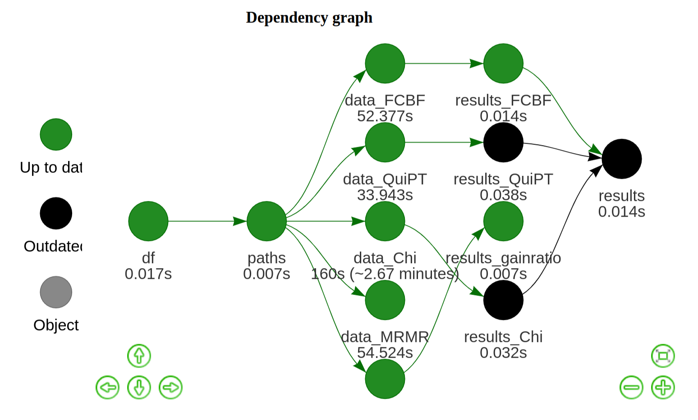
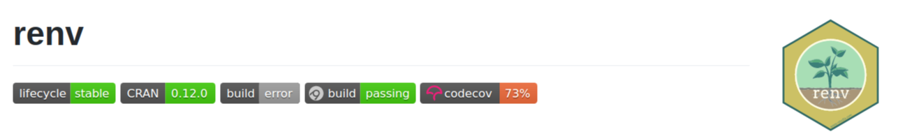

<link href="https://fonts.googleapis.com/css?family=Montserrat&display=swap" rel="stylesheet">

<style>
slides > slide {
  font-family: 'Montserrat';
  
  font-size: 10%;
}

<style>

.center {
  display: block;
  margin-left: auto;
  margin-right: auto;
}

</style>

## Project environments with renv


<div style="float: left; display: flex; width: 50%;">

<center>


<!-- [renv](https://rstudio.github.io/renv/) -->

</center>


</div>

<div style="float: right; width: 45%;">

### renv makes your R project: 

<ul style="margin: 35px;">  
  <li  style="margin: 45px;">isolated</li>
  <li style="margin: 45px;">portable</li>
  <li style="margin: 45px;">reproducible</li>
</uo>


</div>

## renv in a nutshell


<div style="float: left; display: block; width: 50%;">

### renv features: 

<ul>  
  <li>`renv` installs packages from a variety of sources</li>
  <li>supports authentication</li>
  <li>shims allows to take advantage of package cache</li>
</uo>

</div>

<div style="float: right; width: 45%;">


### Simple workflow

<ul>  
  <li> call `renv::init()` to initialize tracking</li>
  <li>`renv::snapshot()` saves the state of the project library to a lockfile</li>
  <li>call `renv::restore()` whenever you would like to revert the changes you have made</li>
</uo>

</div>


## drake

<div style="float: left; display: flex; width: 50%;">

<center>

</center>

<!-- https://docs.ropensci.org/drake/ -->

</div>

<div style="float: right; width: 45%;">

### drake keypoints: 

<ul style="margin: 35px;">  
  <li style="margin: 25px;">analyzes workflow</li>
  <li style="margin: 25px;">skips steps with up-to-date results</li>
  <li style="margin: 25px;">allows distributed computing</li>
</uo>


</div>


## Drake plan

```{r eval = FALSE}
plan <- drake_plan(
  # all the functions you want to call
)
vis_drake_graph()
```

<center>

</center>

## Drake plan

```{r eval = FALSE}
make(plan)
vis_drake_graph()
```

<center>

</center>

## Drake plan

<center>

</center>

## Summary

<center>


</center>


## Thank you!

<miejsce na zdjecie + acknowledgments>
